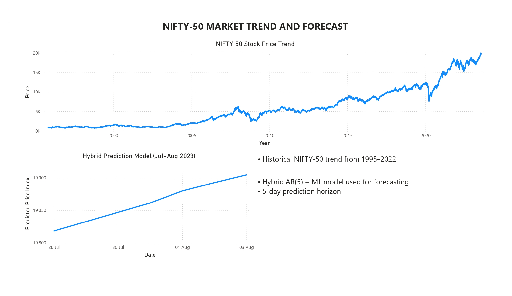
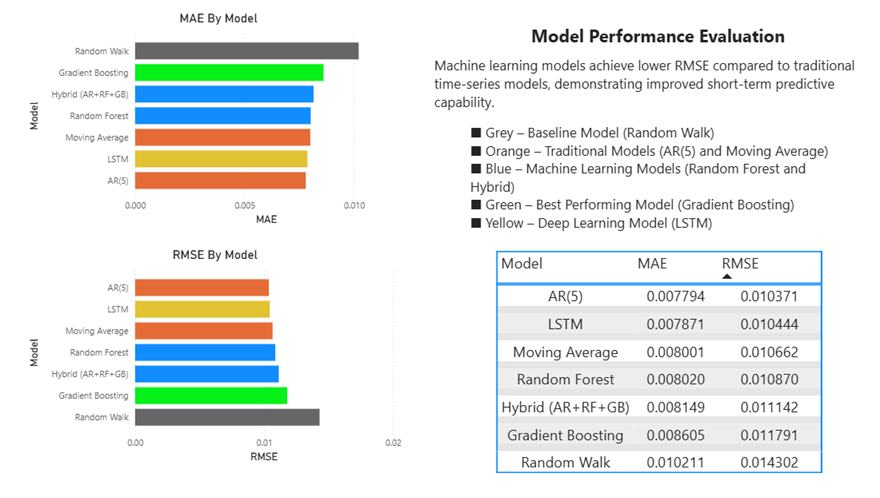
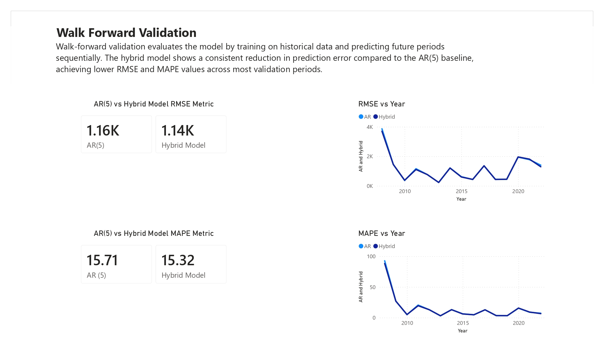

# Machine Learning Models for Financial Market Forecasting
## A Comparative Study and Hybrid Forecasting Framework

---

## Overview

This project investigates statistical, machine learning, deep learning, and hybrid approaches for financial time-series forecasting using historical NIFTY-50 market data.

The study follows a two-stage evaluation process. An initial benchmark compares seven forecasting approaches to identify promising candidate models to combine with the chosen machine learning models. These candidates are then evaluated using a rolling walk-forward validation framework that simulates real-world forecasting across multiple market regimes.

The primary contribution of this work is a hybrid residual-learning framework that combines linear autoregressive modeling with ensemble machine learning to improve forecasting stability while minimizing look-ahead bias.

This project formed the basis of a research paper accepted for publication in the **Proceedings of the 9th IEEE International Conference on Computing Methodologies and Communication (ICCMC 2026).**

---

# Project Objectives

- Compare statistical and machine learning forecasting models.
- Benchmark forecasting performance using standard evaluation metrics.
- Develop a hybrid residual-learning forecasting framework.
- Validate forecasting performance using rolling walk-forward validation.
- Analyze model robustness across changing market conditions.
- Visualize forecasting performance using an interactive Power BI dashboard.

---

# Dataset

**Dataset:** NIFTY-50 Historical Data

- **Period:** November 1995 – July 2023
- **Observations:** 6,899 daily records
- **Source:** Kaggle

The dataset contains the following attributes:

- Date
- Open Price
- High Price
- Low Price
- Close Price
- Volume

The dataset was cleaned, standardized, and sorted chronologically prior to model development.

---

# Forecasting Models

## Preliminary Benchmark

Seven forecasting approaches were initially benchmarked:

- Random Walk
- Autoregressive Model (AR(5))
- Moving Average
- Random Forest
- Gradient Boosting
- Long Short-Term Memory (LSTM)
- Hybrid Residual-Learning Framework

The objective of this stage was to compare different forecasting paradigms and identify suitable candidate models for rigorous evaluation.

---

## Hybrid Forecasting Framework

The proposed forecasting framework consists of two stages.

### Stage 1 — Linear Modeling

An **Autoregressive AR(5)** model captures the linear component of the financial time series.

### Stage 2 — Residual Learning

The remaining forecasting error (residuals) is modeled using ensemble machine learning methods:

- Random Forest
- Gradient Boosting

The final prediction is obtained by combining the autoregressive forecast with the predicted residual component.

This approach enables the model to capture both:

- Linear market dynamics
- Non-linear market behaviour
- Time-varying residual structure

---

# Walk-Forward Validation

The primary evaluation uses a **rolling walk-forward validation** framework.

Unlike conventional train-test splits, walk-forward validation retrains the forecasting model as new observations become available, closely simulating real-world forecasting.

**Validation Period**

- **2008 – 2022**
- **15 yearly forecasting experiments**

Each iteration follows the sequence:

1. Train using all available historical observations.
2. Forecast the following year.
3. Expand the training window.
4. Repeat until the end of the dataset.

This methodology minimizes look-ahead bias while providing a realistic estimate of forecasting performance.

---

# Evaluation Metrics

Model performance was evaluated using:

- Root Mean Squared Error (RMSE)
- Mean Absolute Error (MAE)
- Mean Absolute Percentage Error (MAPE)
- Directional Accuracy
- Coefficient of Determination (R²)

The preliminary benchmark reports all evaluation metrics, while the walk-forward validation primarily focuses on RMSE, MAPE, and Directional Accuracy across yearly forecasting windows.

---

# Dashboard Preview

## Market Trend and Forecast

## Model Comparison

## Walk-Forward Validation

The repository includes an interactive **Microsoft Power BI** dashboard that summarizes:

- Historical market trends
- Forecast comparison
- Walk-forward validation performance
- Model evaluation metrics

The `.pbix` dashboard file is available in the **Dashboard** directory.

---

# Technologies Used

## Programming Language

- Python

## Libraries

- Pandas
- NumPy
- Statsmodels
- Scikit-learn
- TensorFlow
- Matplotlib

## Visualization

- Microsoft Power BI

---

# Key Findings

- Benchmarked seven statistical, machine learning, deep learning, and hybrid forecasting approaches using historical NIFTY-50 market data.
- Developed a hybrid residual-learning framework that combines autoregressive modeling with ensemble machine learning.
- Evaluated forecasting robustness using rolling walk-forward validation across **15 years (2008–2022)** under varying market conditions.
- Demonstrated stable forecasting performance of the hybrid framework while minimizing look-ahead bias through realistic sequential evaluation.
- Highlighted the benefits of combining statistical time-series methods with machine learning for financial forecasting.

---

# Research Publication

**Machine Learning and Modelling Techniques for Financial Data Sciences: A Comparative Study and Hybrid Model Framework for Stock Market Prediction**

*Kashyap Madhav Yeleswarapu, Kshama S. B.*

Accepted for publication in the **Proceedings of the 9th IEEE International Conference on Computing Methodologies and Communication (ICCMC 2026)**.

---

# Future Work

Potential extensions of this work include:

- Incorporating macroeconomic and technical indicators.
- Evaluating Transformer-based forecasting architectures.
- Extending the framework to multiple financial markets and asset classes.
- Investigating probabilistic forecasting techniques.
- Developing real-time forecasting and deployment pipelines.
